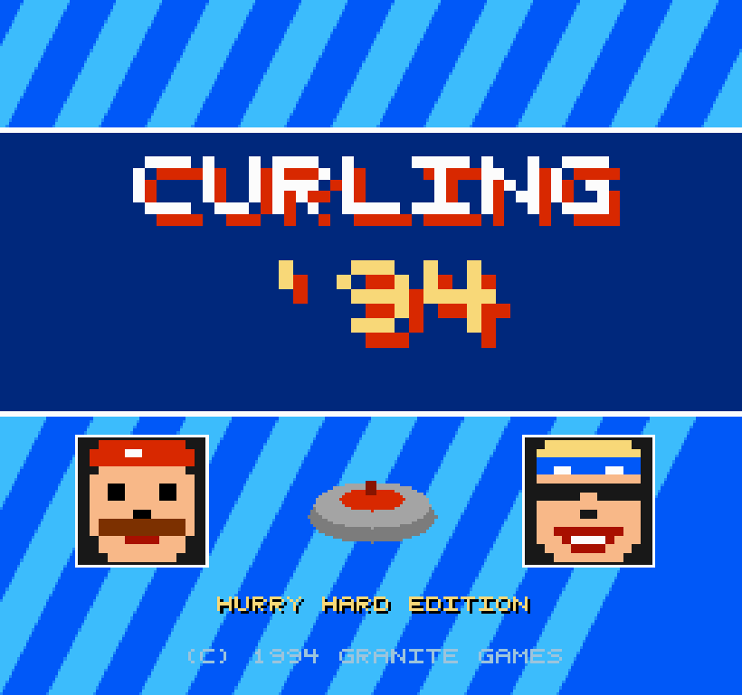
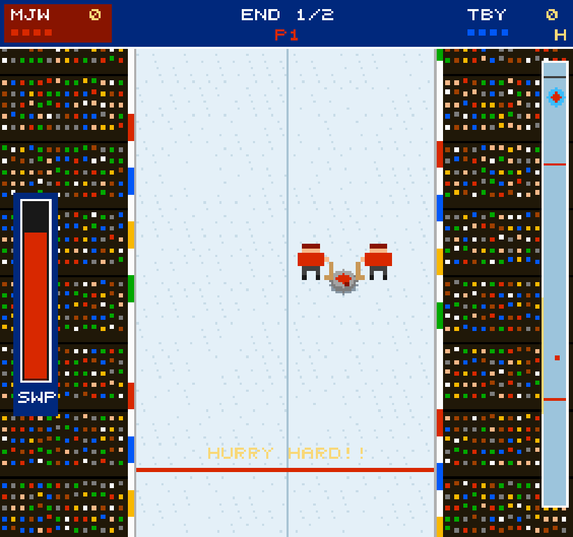
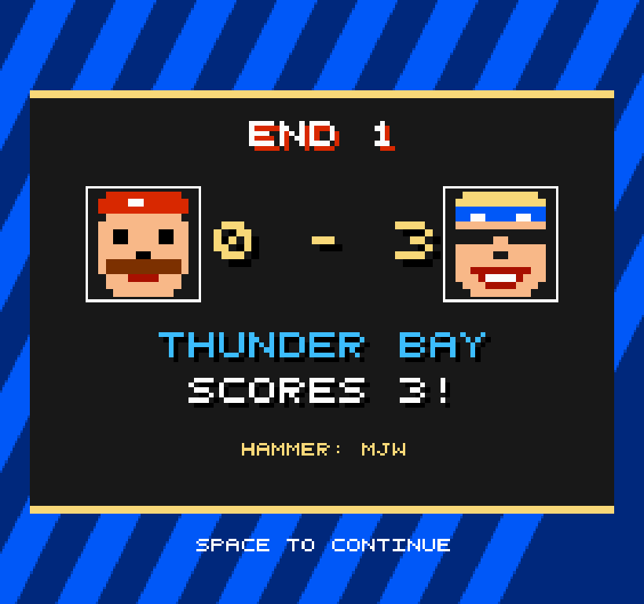

# CURLING '94

*HURRY HARD EDITION — © 1994 GRANITE GAMES*

A 90s-arcade curling game in the spirit of the 16-bit golden age: the
vertical-scrolling rink, crowd and rink-board ads of **NHL '94**, the
oscillating aim-arrow / power-meter mechanics of **Madden field goals**,
and the big flashing splash screens, skip portraits and trash talk of
**Punch-Out!!** and **Windjammers** — all rendered at a chunky 256×240
with a 5×5 pixel font and Web Audio chiptune bleeps.

Underneath the pixels the stones obey real curling physics.

| | | |
|---|---|---|
|  |  |  |

## Play it

No build step, no dependencies. Either open `index.html` directly, or:

```sh
python3 -m http.server 8000
# then visit http://localhost:8000
```

## How to play

**MOOSE JAW** (red) vs **THUNDER BAY** (blue). Throw your stones down the
sheet; closest to the button scores. Most points after the final end wins
(ties go to an extra end).

Each throw is a three-click field-goal routine, then a mash-to-sweep ride:

| Phase  | What happens | Controls |
|--------|--------------|----------|
| HANDLE | Commit to the curl direction first (in-turn / out-turn) | `←` / `→`, then `SPACE` |
| AIM    | The arrow oscillates left/right | `SPACE` to lock it |
| WEIGHT | The power meter oscillates — guard / draw / takeout zones marked | `SPACE` to lock |
| SWEEP  | Stone is away! Sweeping carries it farther and straighter | mash `SPACE` (or `Z`/`X`) |

`ENTER` starts/advances menus. In the setup menu choose VS CPU or
2-player hot seat, stones per team per end (2/4/8), and number of ends.

**Feel lab:** keys `1`–`4` hot-swap game-feel tuning profiles (speed,
meter difficulty, curl, sweeping) any time, even mid-throw. The active
profile shows bottom-left and is remembered. See `NOTES.md` for the
ongoing experiments.

The minimap on the right shows the whole sheet, every stone, and (while
aiming) your projected path — watch it bend as the meter moves and time
your release like a draw-weight pro.

## The physics

- Real sheet dimensions: 4.75 m wide, hog-to-hog 21.95 m, 1.83 m
  (12-foot) house, with hog-line and back-line rules — a thrown stone
  that doesn't fully cross the far hog (and touched nothing) is pulled.
- Stones decelerate at ~0.092 m/s² (championship-ice friction); draw
  weight, guard weight and takeout weight all fall out of `v²/2a`.
- The handle curls the stone with a lateral force that grows as the
  stone slows — most of the bend happens in the last metres, just like
  real granite.
- Sweeping lowers effective friction (~28%) and kills most of the curl,
  so you can carry a light draw or hold a line through the curl.
- Collisions conserve momentum (equal-mass, restitution 0.92): takeouts,
  raises, and ports all work.
- Hammer goes to the team that gives up the end; blank ends keep it.
- Time runs at 2.4× so a draw takes seconds, not half a minute — the
  physics underneath is still in real metres and real m/s.

## Files

- `index.html` — shell page, pixel-scaled canvas
- `game.js` — the entire game: engine, physics, AI skip, sprites, font,
  and Web Audio sound (no assets, everything is drawn and synthesized)
- `test_headless.js` — node smoke test: stubs the DOM, plays a full game
  vs the CPU, and checks the physics calibration (`node test_headless.js`)
- `shots.js` — dev script that captures the screenshots in `shots/`
  using playwright
